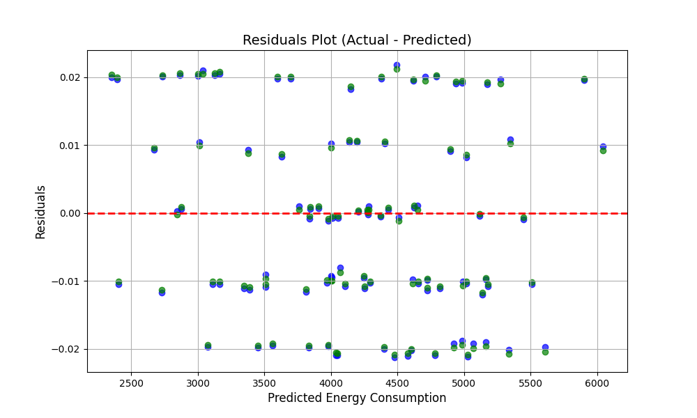

# Energy Consumption Prediction using Linear Regression

## Overview
This project implements **Linear Regression** to predict energy consumption based on various features. Two versions of the model are implemented:
- **From Scratch Implementation** by creating Gradient Descent and Cost Functions from scratch
- **Scikit-Learn Implementation** using Scikit-Learn model Linear Regression

## Dataset
The dataset is sourced from **Kaggle**, containing features such as:
- Square Footage
- Number of Occupants
- Appliances Used
- Average Temperature
- Building Type
- Day of Week

**Target Variable:** `Energy Consumption`

## Visualization

The **Residuals Plot** below highlights the difference between the actual data and the predicted values for both implementations:

- **Green dots**: Represent predictions from the **Scikit-Learn implementation**.
- **Blue dots**: Represent predictions from the **From-Scratch implementation**.

This comparison demonstrates the accuracy and consistency of both approaches in predicting energy consumption.

